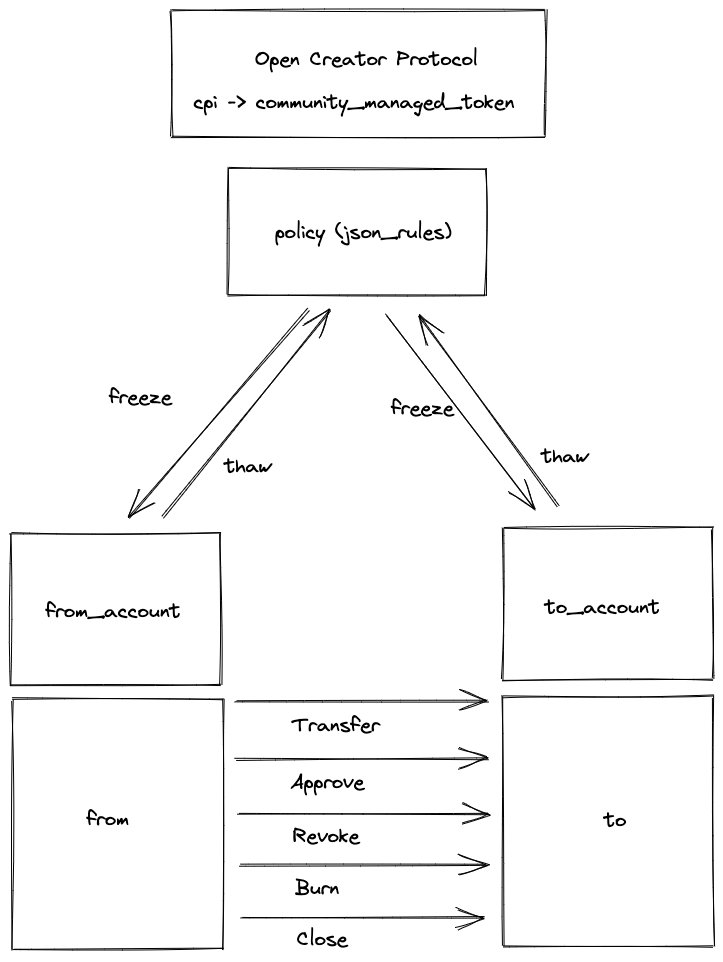
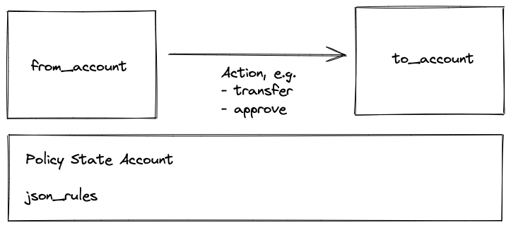
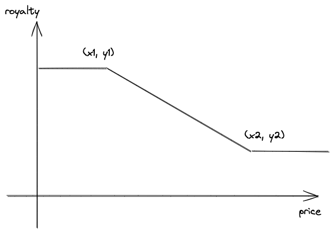

# Open Creator Protocol (OCP)

<p align="center">
    <a href="https://github.com/magiceden-oss/open_creator_protocol/actions/workflows/test.yml?query=branch%3Amain+" target="_blank">
        
    </a>
    <a href="https://crates.io/crates/open_creator_protocol" target="_blank">
        
    </a>
    <a href="https://www.npmjs.com/package/@magiceden-oss/open_creator_protocol" target="_blank">
        
    </a>
</p>


Open Creator Protocol (OCP) is an open protocol for creators to build utilities and the policy engine for their tokens.

## Core Features

- Onchain Policy Engine (to help creators to build utilities and personalized transferability)
- Dynamic Royalty Standard
- Built on top of solana foundation’s spl-managed-token.


## Onchain Accounts

| Network | Type | Address  |
| ----------- | ----------- | ----- |
| Devnet  | Program   | ocp4vWUzA2z2XMYJ3QhM9vWdyoyoQwAFJhRdVTbvo9E |
| Devnet  | Policy (allow all) | 6Huqrb4xxmmNA4NufYdgpmspoLmjXFd3qEfteCddLgSz |

| Network | Type | Address  |
| ----------- | ----------- | ----- |
| Mainnet | Program   | ocp4vWUzA2z2XMYJ3QhM9vWdyoyoQwAFJhRdVTbvo9E |
| Mainnet | Policy (allow all) | 7evQhBswiztNd6HLvNWsh1Ekc3fmyvQGnL82uDepSMbw |

## Architecture

### Overview



OCP uses [SPL managed-token](https://github.com/solana-labs/solana-program-library/tree/master/managed-token) as the base for holding the freeze authority of the spl-token. And managed-token has 1:1 feature parity of the spl-token in terms of the token interfaces like `transfer`, `approve`, `revoke`, `burn`, `close`, `init_account` and `mint_to`.

### Onchain Policy Engine



Action context is the context used to build the json rules engine. OCP's solution is a JSON rules engine DSL to define what can be applied to the context.

```
pub struct ActionCtx {
    pub action: String,
    pub program_ids: Vec<String>,
    pub mint: String,
    pub mint_state: MintStateCtx,
    pub mint_account: Option<MintAccountCtx>,
    pub metadata: Option<MetadataCtx>,
    pub payer: Option<String>,
    pub from: Option<String>, // owner of the from_account, and many action's initiator
    pub to: Option<String>,   // owner of the to_account
    pub last_memo_signer: Option<String>,
    pub last_memo_data: Option<String>,
}
```

| Sample Use Cases | Policy (json_rule)  |
| ----------- | ----------- |
| Allow For All | null |
| Program IDs Allowlist | `{ "field": "program_ids", "operator": "string_is_subset", "value": ["1111111111111111111111111111111"]}` |
| Program IDs Denylist | `{ "field": "program_ids", "operator": "string_does_not_contain_any", "value": ["1111111111111111111111111111111"]}` |
| Soulbound Token | `{ "field": "mint_state/transferred_count", "operator": "int_less_than", "value": 1 }` |
| Semi Soulbound Token | `{ "field": "mint_state/transferred_count", "operator": "int_less_than", "value": n }` |
| Transfer Timestamp Constraint | `{ "field": "mint_state/derived_datetime/utc_timestamp", "operator": "int_greater_than", "value": 1669881409}` |
| Transfer Cooldown Token | `{ "field": "mint_state/derived_cooldown", "operator": "int_greater_than", "value": 3600 }` |
| Metadata Name Filter | `{ "field": "metadata/name", "operator": "string_has_substring", "value": "FROZEN"}` |
| Metadata URI Filter | `{ "field": "metadata/uri", "operator": "string_has_substring", "value": "IPFS"}` |
| Single Transfer Destination | `{ "field": "to", "operator": "string_equals", "value": ["1111111111111111111111111111111"]}` |

Here's a full example of how a creator can leverage OCP to personalize the transferability. The logic works like this:

- When the `action` is not `transfer`, pass
- When the `action` is `transfer`, then one cannot transfer if the `metadata/name` contains a keyword `FROZEN`
- When the `action` is `transfer`, then one cannot transfer to a specific address if the `metadata/name` doesn't contain `WINNER`.

```
{
  "events": [],
  "conditions": {
    "or": [
      {
        "field": "action",
        "operator": "string_not_equals",
        "value": "transfer"
      },
      {
        "and": [
          {
            "not": {
              "field": "metadata/name",
              "operator": "string_has_substring",
              "value": "FROZEN"
            }
          },
          {
            "or": [
              {
                "field": "to",
                "operator": "string_not_equals",
                "value": "DWuopEsTrg5qWMSMVT1hoiVTRQG9PkGJZSbXiKAxHYbn"
              },
              {
                "field": "metadata/name",
                "operator": "string_has_substring",
                "value": "WINNER"
              }
            ]
          }
        ]
      }
    ]
  }
}
```


### Dynamic Royalty



Dynamic royalties - Creators can specify a relationship between an NFT’s sale price and royalty amount via a linear price curve. And more curve types to be supported in the future.

The first dynamic royalty curve OCP supports is `DynamicRoyaltyPriceLinear`. Both `start_multiplier_bp` and `end_multiplier_bp` are relative multipliers based on the Metaplex's `metadata.seller_fee_basis_points`.

```rust
pub struct DynamicRoyaltyPriceLinear {
    pub price_mint: Option<Pubkey>,
    pub start_price: u64,
    pub end_price: u64,
    pub start_multiplier_bp: u16,
    pub end_multiplier_bp: u16,
}
```

Specifically, if we note that r is the final multiplier_bp, then
$$r = y1 + (y2 - y1) * (price - x1) / (x2 - x1)$$

For example, given a dynamic royalty setting:
```bash
DynamicRoyaltyPriceLinear:
{
  start_price: 0 SOL
  end_price: 5 SOL
  start_multiplier_bp: 100% (10000 bp)
  end_multiplier_bp: 50% (0 bp)
}

Metadata:
seller_fee_basis_points: 5% (500 bp)

price: 0 SOL   ===> royalty_bp: 500 (5%)
price: 2.5 SOL ===> royalty_bp: 375 (3.75%)
price: 5 SOL   ===> royalty_bp: 250 (2.5%)
```


## Development

```bash
# Install deps
npm i

# To build and generate the solitarc
./build.sh

# To test
anchor test
```

## Using the CLI

```bash
# To create a policy without a dynamic royalty setting
CLI_COMMAND=create_policy \
CLI_AUTHORITY=./keypair.json \
CLI_RPC=https://api.devnet.solana.com \
CLI_JSON_RULE='{"conditions":{"field":"action","operator":"string_not_equals","value":""},"events":[]}' \
  ts-node sdk/src/cli.ts

# To create a policy with a dynamic royalty setting
CLI_COMMAND=create_policy \
CLI_AUTHORITY=./keypair.json \
CLI_RPC=https://api.devnet.solana.com \
CLI_JSON_RULE='{"conditions":{"field":"action","operator":"string_not_equals","value":""},"events":[]}' \
CLI_DYNAMIC_ROYALTY_PRICE_LINEAR='{"startPrice":0,"endPrice":5000000000,"startMultiplierBp":10000,"endMultiplierBp":0}' \
  ts-node sdk/src/cli.ts

# To update a policy
CLI_POLICY_PUBKEY=TODO \
CLI_COMMAND=update_policy \
CLI_AUTHORITY=./keypair.json \
CLI_RPC=https://api.devnet.solana.com \
CLI_JSON_RULE='{"conditions":{"field":"action","operator":"string_not_equals","value":""},"events":[]}' \
CLI_DYNAMIC_ROYALTY_PRICE_LINEAR='{"startPrice":0,"endPrice":5000000000,"startMultiplierBp":10000,"endMultiplierBp":0}' \
  ts-node sdk/src/cli.ts
```

## Licenses
- Apache 2.0
