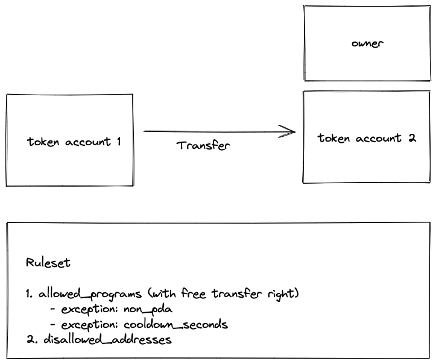

# mtoken: Magic Token Wrapper

## Architecture

Overview


Ruleset



## Development

```bash
# Install deps
npm i

# To build
anchor build

# To test
anchor test

# To generate the solita anchor generated clients
npx solita
```

## Licenses
- AGPL-3.0
- Source Code Forked from https://github.com/cardinal-labs/cardinal-creator-standard (AGPL-3.0 license)
